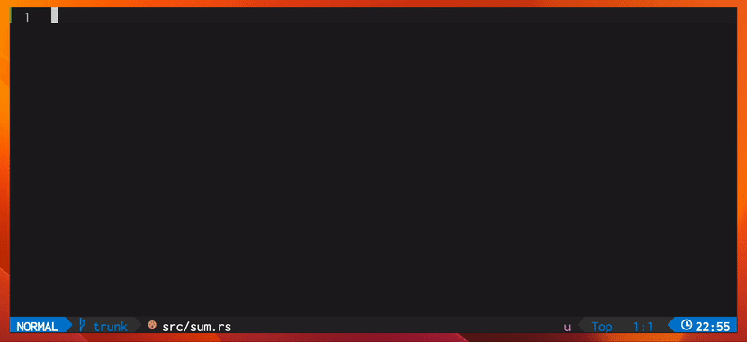

# LLM powered development for Neovim

> [!IMPORTANT]
> This is currently a work in progress, expect things to be broken!

**llm.nvim** is a plugin for all things LLM.

This project is influenced by [copilot.vim](https://github.com/github/copilot.vim) and [tabnine-nvim](https://github.com/codota/tabnine-nvim)

Formerly **hfcc.nvim**.



## Features

### Code completion

This plugin supports "ghost-text" code completion, à la Copilot.


### Choose your model

Requests for code generation are made via `curl` to an HTTP endpoint.

You can use the Hugging Face [Inference API](https://huggingface.co/inference-api) or your own HTTP endpoint, provided it adheres to the API specified [here](https://huggingface.co/docs/api-inference/detailed_parameters#text-generation-task).

> [!NOTE]
> Requests via `curl` are a legacy feature. This plugin is evolving to become a front-end for [`llm-ls`](https://github.com/huggingface/llm-ls).

#### [Starcoder](https://huggingface.co/bigcode/starcoder)

```lua
{
  model_eos = "<|endoftext|>",
  fim = {
    enabled = true,
    prefix = "<fim_prefix>",
    middle = "<fim_middle>",
    suffix = "<fim_suffix>",
  },
  model = "bigcode/starcoder",
  context_window = 8192,
}
```

> [!NOTE]
> These are the default config values

#### [CodeLlama](https://huggingface.co/codellama/CodeLlama-13b-hf)

```lua
{
  model_eos = "<EOT>",
  fim = {
    enabled = true,
    prefix = "<PRE> ",
    middle = " <MID>",
    suffix = " <SUF>",
  },
  model = "codellama/CodeLlama-13b-hf",
  context_window = 4096,
}
```

> [!NOTE]
> Spaces are important here


## Install

### With Inference API

1. Create and get your API token from here https://huggingface.co/settings/tokens.

2. Define how the plugin will read your token. For this you have multiple options, in order of precedence:
    1. Pass `api_token = <your token>` in plugin opts - this is not recommended if you use a versioning tool for your configuration files
    2. Set the `LLM_NVIM_API_TOKEN` environment variable
    3. You can define your `HF_HOME` environment variable and create a file containing your token at `$HF_HOME/token`
    4. Install the [huggingface-cli](https://huggingface.co/docs/huggingface_hub/quick-start) and run `huggingface-cli login` - this will prompt you to enter your token and set it at the right path

3. Choose your model on the [Hugging Face Hub](https://huggingface.co/), and, in order of precedence, you can either:
    1. Set the `LLM_NVIM_MODEL` environment variable
    2. Pass `model = <model identifier>` in plugin opts

### With your own HTTP endpoint

All of the above still applies, but note:

* When `api_token` is set, it will be passed as a header: `Authorization: Bearer <api_token>`.

* Instead of setting a Hugging Face model identifier in `model`, set the URL for your HTTP endpoint.

### Using [packer](https://github.com/wbthomason/packer.nvim)

```lua
require("packer").startup(function(use)
  use {
    'huggingface/llm.nvim',
    config = function()
      require('llm').setup({
        -- cf Setup
      })
    end
  }
end)
```

### Using [lazy.nvim](https://github.com/folke/lazy.nvim)

```lua
require("lazy").setup({
  {
    'huggingface/llm.nvim',
    opts = {
      -- cf Setup
    }
  },
})
```

### Using [vim-plug](https://github.com/junegunn/vim-plug)

```vim
Plug 'huggingface/llm.nvim'
```
```lua
require('llm').setup({
  -- cf Setup
})
```

## Setup

```lua
local llm = require('llm')

llm.setup({
  api_token = nil, -- cf Install paragraph
  model = "bigcode/starcoder", -- can be a model ID or an http(s) endpoint
  model_eos = "<|endoftext|>", -- needed to clean the model's output
  -- parameters that are added to the request body
  query_params = {
    max_new_tokens = 60,
    temperature = 0.2,
    top_p = 0.95,
    stop_tokens = nil,
  },
  -- set this if the model supports fill in the middle
  fim = {
    enabled = true,
    prefix = "<fim_prefix>",
    middle = "<fim_middle>",
    suffix = "<fim_suffix>",
  },
  debounce_ms = 150,
  accept_keymap = "<Tab>",
  dismiss_keymap = "<S-Tab>",
  max_context_after = 5000,
  max_context_before = 5000,
  tls_skip_verify_insecure = false,
  -- llm-ls integration
  lsp = {
    enabled = false,
    bin_path = vim.api.nvim_call_function("stdpath", { "data" }) .. "/llm_nvim/bin/llm-ls",
  },
  tokenizer_path = nil, -- when setting model as a URL, set this var
  context_window = 8192, -- max number of tokens for the context window
})

```

## Commands

- `LLMToggleAutoSuggest` which enables/disables ghost text completion

